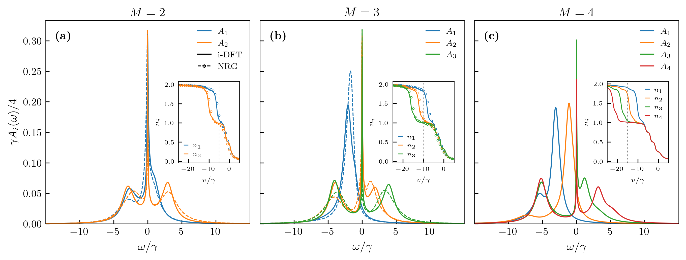
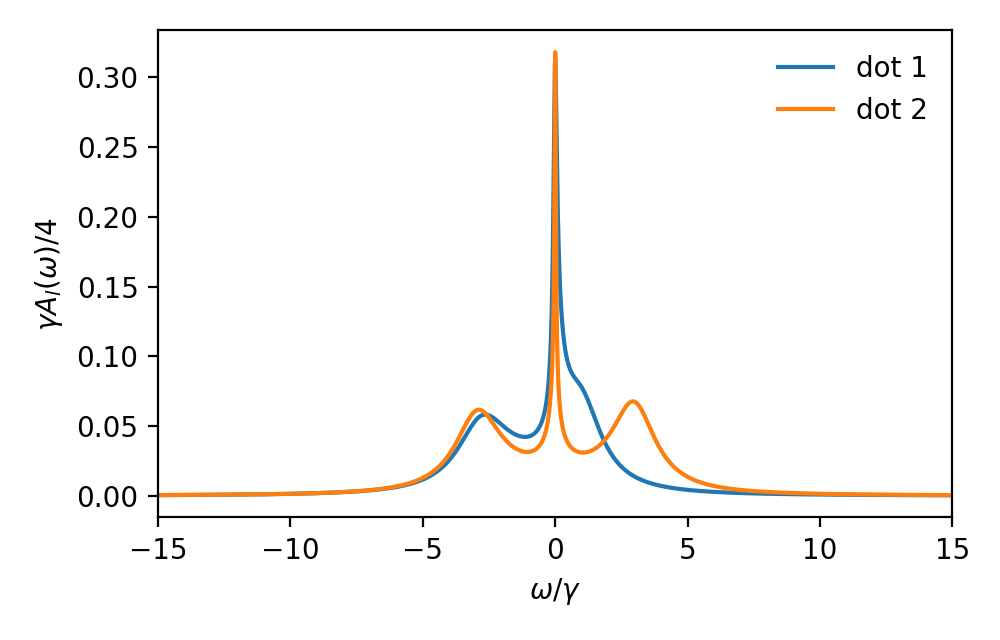
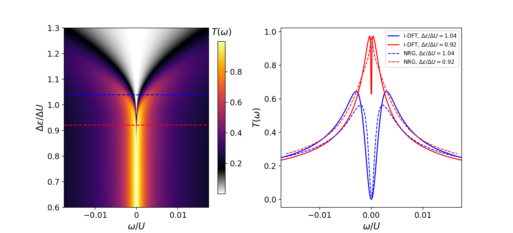

# i-DFT for multiple quantum dots: spectra and transmission

[](https://www.python.org/)
[](LICENSE)
[](https://doi.org/10.5281/zenodo.20154932)

Code for the paper

> N. Sobrino and S. Kurth,
> **Spectral and transmission properties of multiple correlated quantum dots made simple**

Steady-state density functional theory (i-DFT) gives the spectral and
transmission functions of interacting multiple quantum dots (MQDs) coupled to
electronic reservoirs from an effectively non-interacting Kohn–Sham (KS)
system. The dot occupations come from `M` coupled self-consistency
equations. After that, each frequency requires one extra, independent
non-linear equation:

```
tau(w) = tau_s(w + V_xc) / [ 1 - (1/pi) dV_xc/dI * tau_s(w + V_xc) ]
```

Here `tau_s` is the KS spectral (or transmission) function, and the
exchange-correlation bias `V_xc` and its derivative are evaluated at the
probe current `I(w)`. Many-body methods work in a Fock space that grows
exponentially with `M`. i-DFT costs about as much as a mean-field
calculation, and with the functionals built in the paper it captures
Coulomb blockade and Kondo physics.

This repository contains the i-DFT engines, the exact grand-canonical
reference, the scripts that produce every figure of the paper, and the NRG
benchmark calculations for the Kondo-regime spectra.

<p align="center">
  
</p>
<p align="center"><sub>Fig. 3: local spectral functions of 2, 3 and 4 dots in the Kondo regime. i-DFT is drawn solid and NRG dashed; the insets show the occupations.</sub></p>

## Quick start

```bash
git clone https://github.com/Nahualcsc/idft-multiple-quantum-dots.git
cd idft-multiple-quantum-dots
pip install -r requirements.txt
python examples/quickstart.py      # < 1 s: Kondo spectra of a double dot
```

```python
from i_DFT_NQD import i_DFT_M_t0    # in paper_figures/

g = 0.1                              # substrate broadening gamma
dft = i_DFT_M_t0(v_list=[-5*g, -5*g], V=0.0, TL=1e-5*g, TR=1e-5*g,
                 U_list=[4*g, 6*g], Uij=2*g, gammaL=1e-4, gammaR=g,
                 gamma_off=0, t=0.0, Vxc_approach="Vxc_option1", Kondo_factor=True)
n = dft.densities([1.0, 1.0])        # self-consistent occupations -> [1.079, 0.986]
dft.set_n(n)
A = dft.A(0.0)                       # local spectral functions A_l(w) of all dots at w = 0
```

<p align="center"></p>

## Repository layout

```
.
├── paper_figures/                  engines and figure scripts (flat, run from this folder)
│   ├── i_DFT_NQD.py                i-DFT for M dots: densities, local spectral functions A_l(w)   (Figs. 1-3)
│   ├── iDFT_Transmission_fig4.py   i-DFT transmission T(w) of a double dot                       (Fig. 4)
│   ├── GCE_NQD.py                  exact grand-canonical ensemble reference for isolated MQDs     (Figs. 1-2)
│   ├── figure1_REG1.py             Fig. 1: quadruple dot, Coulomb blockade, i-DFT vs GCE
│   ├── figure2_hoppingCIM.py       Fig. 2: quadruple dot with interdot hopping (CIM), i-DFT vs GCE
│   ├── figure3_kondo_nrg.py        Fig. 3: Kondo regime for M = 2, 3, 4, i-DFT vs NRG
│   ├── figure4.py                  Fig. 4: double-dot transmission map vs detuning, i-DFT vs NRG
│   ├── panel_{b,c}_digitized.txt   NRG line cuts of Kleeorin & Meir, Sci. Rep. 8, 10539 (2018)
│   └── zenodo_data_saver_*.py      write each figure's data as npz + csv + metadata (Zenodo format)
├── nrg_benchmark/                  full-density-matrix NRG for the M = 2 and M = 3 panels of Fig. 3
│   ├── M2_double_dot/              engine, ED test, inputs, run scripts, spectra and occupations
│   └── M3_triple_dot/              engine, ED test, inputs, cluster setup, spectra and occupations
├── examples/quickstart.py
└── docs/                           images used in this README
```

## Reproducing the figures

```bash
cd paper_figures
python figure1_REG1.py
python figure2_hoppingCIM.py
python figure3_kondo_nrg.py
python figure4.py
```

Each script writes its figure to `paper_figures/figureN/`. It also writes
the figure's data in the format of the Zenodo record to
`paper_figures/zenodo_repository/data/figure_N/`, with `.npz`, CSV, metadata
JSON and a README. Both output folders are git-ignored. The heavy loops run
in parallel through joblib (`n_jobs=-2`).

| Figure | Script | Engine | System | Wall time* |
|---|---|---|---|---|
| 1 | `figure1_REG1.py` | `i_DFT_NQD.py` + `GCE_NQD.py` | 4 dots, `U_l = 5-8.75`, `U_lm = 5`, `T = 0.5` | 26 s |
| 2 | `figure2_hoppingCIM.py` | `i_DFT_NQD.py` + `GCE_NQD.py` | 4 dots, CIM `U = 5`, hopping `t = 5`, `T = 0.5` | 26 s |
| 3 | `figure3_kondo_nrg.py` | `i_DFT_NQD.py` + NRG data | 2, 3, 4 dots, Kondo regime, `T = 1e-5` | 3 s |
| 4 | `figure4.py` | `iDFT_Transmission_fig4.py` | double dot, `U/gamma = 15`, `DeltaU = U/3`, `T = 3e-6 U` | 15 s |

<sub>*Apple M4 Max, 16 cores. Energies are in units of `gamma` (Figs. 1-3) or `U` (Fig. 4).</sub>

**Verified:** running the four scripts from a clean copy of this repository
gives the data of the Zenodo record. Figs. 1, 3 and 4 match bit for bit, and
Fig. 2 matches to 1e-8, which is eigen-solver roundoff.

### Functional parameters

The widths of the Hxc potential (`w0`) and of the Kondo factor (`w1`) differ
between figures. They are set as follows:

| | `w0` (Hxc potential) | `w0` (xc bias) | `w1` (Kondo factor) | Kondo factor |
|---|---|---|---|---|
| Figs. 1-2 | 0.16 | 0.16 | — | off |
| Fig. 3 | 0.16 | 0.16 | 0.16 | on |
| Fig. 4 | 0.08 | 0.16 | 0.48 | on |

Figs. 1-2 take the defaults of `i_DFT_NQD.py` (`ww = ww2 = ww3 = 0.16`).
`figure3_kondo_nrg.py` sets its widths explicitly. Fig. 4 uses its own
engine, which evaluates the transmission with the full (off-diagonal)
coupling matrix of a double dot.

<p align="center">
  
</p>
<p align="center"><sub>Fig. 4: transmission of a double quantum dot as a function of detuning, i-DFT, with the NRG line cuts of Kleeorin and Meir.</sub></p>

## NRG benchmark

`nrg_benchmark/` holds a full-density-matrix NRG code written for this work.
It uses `U(1)^(2M)` symmetry, one reservoir per dot, z averaging and the
self-energy trick generalized to interdot interactions. The folder also has
the inputs and outputs of the reference calculations for Fig. 3(a) and (b).
The engine is checked against exact diagonalization to 1e-14:

```bash
cd nrg_benchmark/M2_double_dot/scripts
python test_nrg_ed.py            # ~20 s
python 02_generate_nrg.py        # ~2 s: rebroaden the archived FDM checkpoints into spectra
```

A new `M = 2` run takes about 15 min and up to 18 GB of memory per z shift.
The `M = 3` run needs a cluster. See [`nrg_benchmark/README.md`](nrg_benchmark/README.md)
for the method, the convergence checks and the measured run times.

## Data

The numerical data of all figures (npz, CSV, metadata and a stand-alone
plotting script per figure) are archived on Zenodo at
[doi:10.5281/zenodo.20154932](https://doi.org/10.5281/zenodo.20154932).

## Requirements

Python ≥ 3.10 with numpy ≥ 2.0, scipy, matplotlib, joblib, tqdm and mpmath
(mpmath is needed only for NRG). Tested with Python 3.12.9, numpy 2.3.2,
scipy 1.17.1, matplotlib 3.10.9, joblib 1.5.3, tqdm 4.67.1 and mpmath 1.3.0.
The scripts for Figs. 1-3 render their labels with LaTeX (`text.usetex`), so
they need a LaTeX installation.

## Citation

If you use this code, please cite the paper and the dataset. See
[`CITATION.cff`](CITATION.cff); GitHub's "Cite this repository" button reads it.

## License

The code is released under the [MIT License](LICENSE). The Zenodo dataset is
licensed under CC-BY-4.0.

## Contact

N. Sobrino, The Abdus Salam International Centre for Theoretical Physics (ICTP), Trieste: nsobrino@ictp.it
